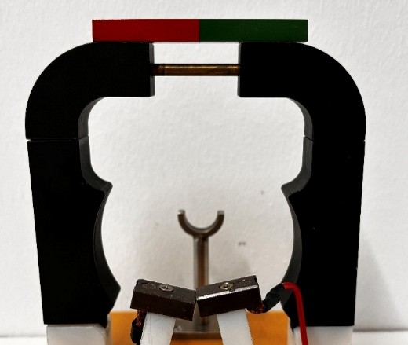

Das äußere unbewegliche Metallgerüst nennt man Stator.  Links und rechts befinden sich zwei Metallstangen, die mit einem Dauermagneten oben verbunden sind.

Aufgabe: 
Untersuche die beiden seitlichen Metallstangen auf Magnetismus. 
Wie hängt das mit der Beobachtung an der langen Spule zusammen?

