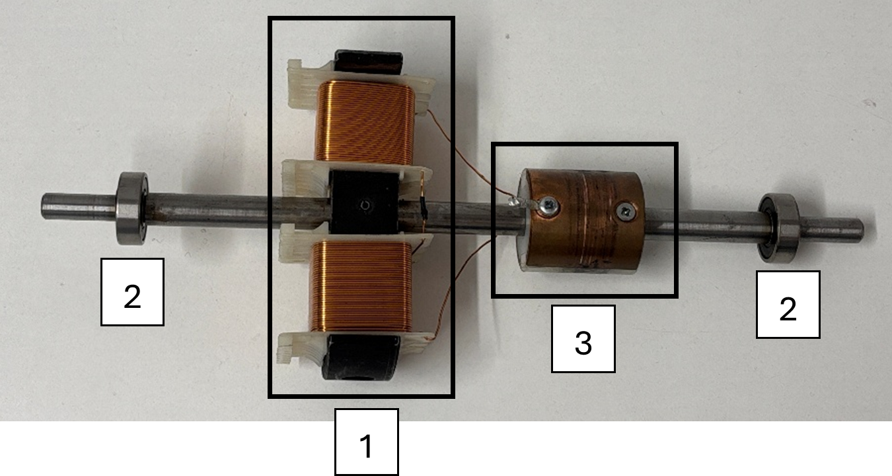

Die Spulen-Konstellation im Inneren nennt sich Rotor – aufgrund der rotierenden Bewegung

1) Welche Funktion hat die Spulenkonstellation (1), habt ihr in dem vorherigen Experiment etwas Vergleichbares schon gesehen?
2) Beschreibe die Kontaktflächen (3), was fällt auf, wofür benötigt man diese?
3) Bringe – bei ausgeschalteter Spannungsquelle - den Rotor in horizontale (liegende) Position und erhöhe dann – nach dem Einschalten - die Spannung, was lässt sich beobachten?

